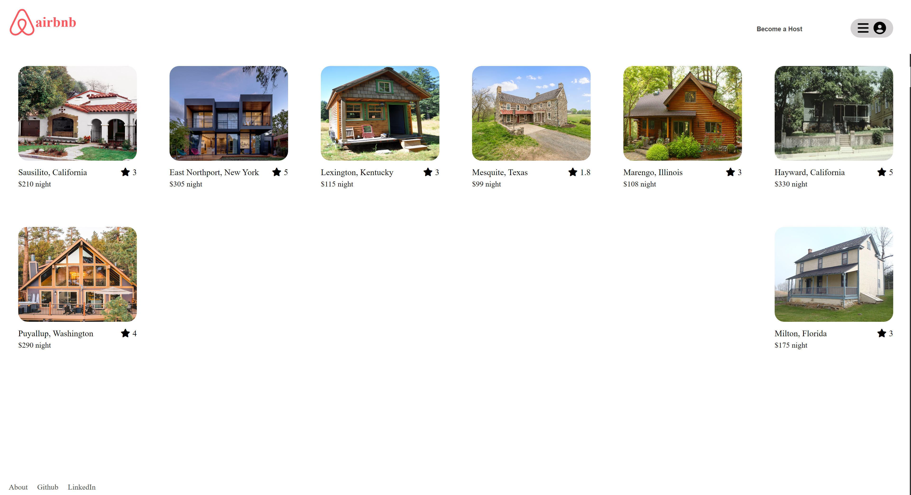
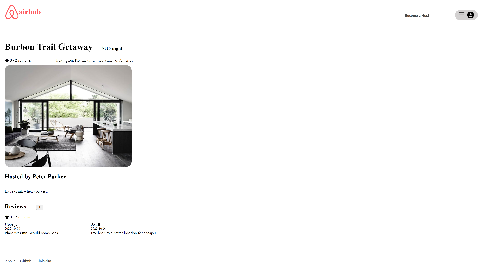
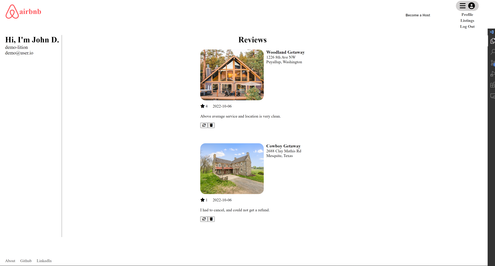
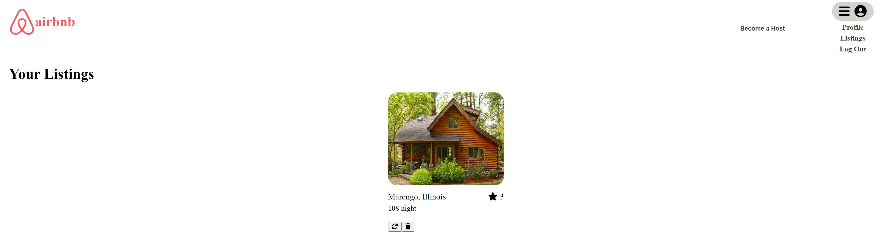

# Welcome to AirBnB Clone Project
# Live link: [AirbnbClone](https://airbnb-backendapi-aa-proj.herokuapp.com/)

I am currently learning the skills and tools needed to be a software engineer. This is the very first project I have ever completed, with many more to come. At this point in time, it is the best that I can do with my knowledge and experience at hand. This is my attempt at creating an airbnb clone. It is capable of displaying, creating, editing, and deleting locations, as well as reviews for those locations. It is a PERN Full Stack application utilizing PostgresSQL/Express for the backend and React/Redux for the frontend.

### Table of Contents
1. [Getting Started](#getting_started)
2. [Technologies Implemented](#technologies)
3. [Frontend Features](#features)
4. [Frontend Overview](#overview)
5. [Challenges and Hurdles](#challenges)
6. [Future Features](#future)   

<a name="getting_started"/>

### Getting Started
1. [Clone Repository](https://github.com/gmerida92/AirBnB)
2. Install Dependences `npm install`
3. In the backend folder create a `.env` file based on the `env.example`
4. In the backend folder create the database by:
    1. Running `dotenv npx sequelize db:migrate`
    2. Running `dotenv npx sequelize db:seed:all`
5. Start the application:
    1. In the backend folder run `npm start`
    2. In the frontend run folder `npm start`

<a name="technologies"/>

### Technologies Implemented

<a name="features"/>

### Frontend Features
* Demo User
* User
    * Sign Up New User
    * Login
    * Logout
* Spots
    * Get all Spots
    * Get details of Spot from id
    * Get all the spots owned (created) by the Current User
    * Create a Spot
    * Edit a Spot
    * Delete a Spot
* Reviews
    * Get all Reviews of the Current User
    * Get all Reviews by a Spot's id
    * Create a Review for a Spot based on the Spot's id

<a name="overview"/>

### Frontend Overview
The landing page allows you to login and sign up to the website. The navigation is dynamic and changes options on whether you are logged in. When logged in, you have the option create a new spot by becoming a host.

If you click on a listing on the landing page, you are taken to the listings detail page. Depending on whether you are logged in, a user may visit a listings detail page to submit a new review. When submitted it will display on the listings detail page.

When logged in, the user can visit user only pages, the profile and listings page. In the profile page, user details is displayed, as well as reviews posted by the user. Here they can update or remove a review.

In the listings page, the user can view all listings owned by the user. Here they can update or remove a listing.

<a name="challenges"/>

### Challenges and Hurdles
Completing both a backend and frontend project had its ups and downs. I found the frontend project more user friendly, compared to the backend project. The frontend provided error management that would allow the SWE to find error points and debug easily, while the backend did not. Managing data in redux is very powerful and simplifys the backend data, but it does require the SWE to understand and follow foundational standards to properly create the state. Specifically, reducers needed to make deep enough copies of the backend data in order to properly render and update data in the frontend. I had to re-configure my reducers in order to fix my rendering issues. The use of modals added a new challenge, especially when it came to closing modal windows when data is submitted. Overall it was a great learning experience.

<a name="future"/>

### Future Features
In addition, restructuring my component directory to be more intuitive and efficient, there are 2 features I am interested in applying. I would like to have dynamic maps that show locations as well as clicking the locations on the map and open the listings individual page. 